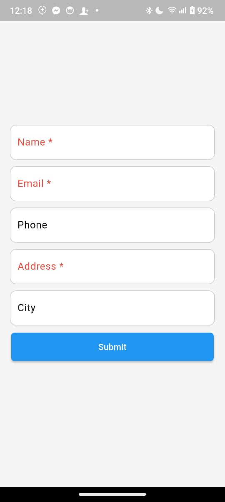
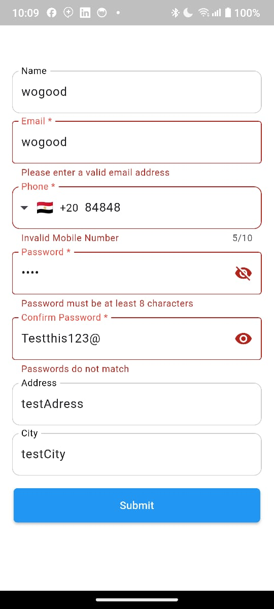
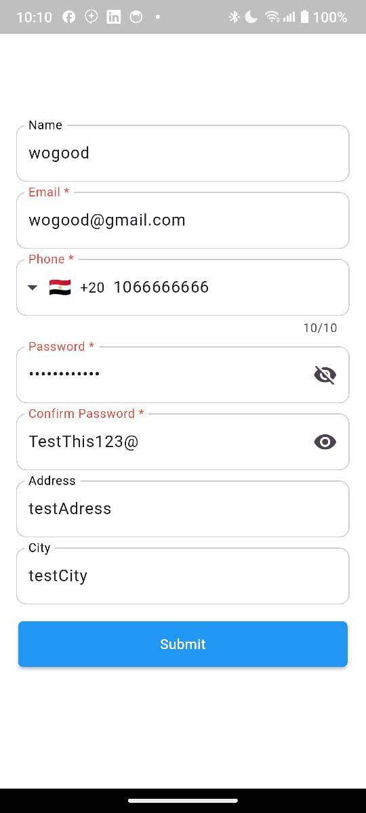

# CustomFormW

A flexible and customizable form widget for Flutter that allows for dynamic form creation with validation, custom labels, styling, and more.
## Screenshots



 
 
## Example
```dart
import 'package:custom_form_w/custom_form.dart';
import 'package:flutter/material.dart';

void main() {
  runApp(
    MaterialApp(
      home: Scaffold(
        body: CustomFormW(
          numberOfFields: 3,
          requiredFieldIndices: [1, 2],
          labelText: ['Name', 'Email', 'Phone'],
          onSubmit: () {
            print('Form submitted');
          },
          //for email validation , password length validation and phone number validation
          keyboardType: [
                  TextInputType.text,
                  TextInputType.emailAddress,
                  TextInputType.phone,
                  TextInputType.visiblePassword,
                  TextInputType.visiblePassword,
                  TextInputType.text,
                  TextInputType.text,
                ],
        ),
      ),
    ),
  );
}
```
## Features
- Create dynamic forms with a specified number of fields.
- Highlight required fields with asterisks (*).
- Customize field labels, hints, and styles.
- Supports multiple input types (e.g., text, email).
- Easy-to-use validation for required fields.
- Configurable submit button with custom text, color, and action.
- Customizable border styles and form layout.
- Optional submit button visibility.
- Optional validation snackbar.
- Optional phone number validation.
- Optional email validation.
- Optional password length validation.
- Optional validation snackbar text.
## Parameters:
- numberOfFields: Required - Number of fields in the form.    
- requiredFieldIndices: Required - List of indices (1-based) of required fields.
- labelText: Required - List of labels for each field.
- controllers: Required - List of TextEditingController for managing text input.
- formKey: Optional - A GlobalKey<FormState> for form validation.
- buttonText: Optional - Text for the submit button (default: 'Submit').
- buttonColor: Optional - Color for the submit button (default: Colors.blue).
- buttonTextStyle: Optional - Style for the submit button text (default: TextStyle(color: Colors.white)).
- suffixIcon, prefixIcon: Optional - Widgets for icons that appear at the end or start of the input fields.
- keyboardType: Optional - List of keyboard types for each input field (e.g., TextInputType.emailAddress).
- labelStyle: Optional - TextStyle for labels.
- requiredColor, labelColor: Optional - Color options for the labels.
- radius: Optional - Border radius for input fields (default: 10.0).
- onSubmit: Optional - Callback function for form submission.
- showButton: Optional - Whether to show the submit button (default: true).
- spacing: Optional - Spacing between fields (default: 10.0).
- enabledBorderColor, focusedBorderColor: Optional - Colors for input field borders.
- hintStyle: Optional - TextStyle for the hint text.
- hintText: Optional - List of hint texts for the fields.
- validationSnackBarText: Optional - Text for the validation snackbar (default: 'Form is valid'). 
- phoneRegex: Optional - Regex for phone number validation (default: r'^\d{10}$').
- phoneRegexError: Optional - Error message for phone number validation (default: 'Please enter a valid 10-digit phone number').
- emailRegex: Optional - Regex for email validation (default: r'^[a-zA-Z0-9._%+-]+@[a-zA-Z0-9.-]+\.[a-zA-Z]{2,}$').
- emailRegexError: Optional - Error message for email validation (default: 'Please enter a valid email address').
- passwordLength: Optional - Minimum length for password validation (default: 8).
- passwordLengthError: Optional - Error message for password length validation (default: 'Password must be at least 8 characters long').

## Installation

Add this to your `pubspec.yaml` file:

```yaml
dependencies:
  custom_form_w: ^2.0.0 
```
## Then run 
`flutter pub get`

